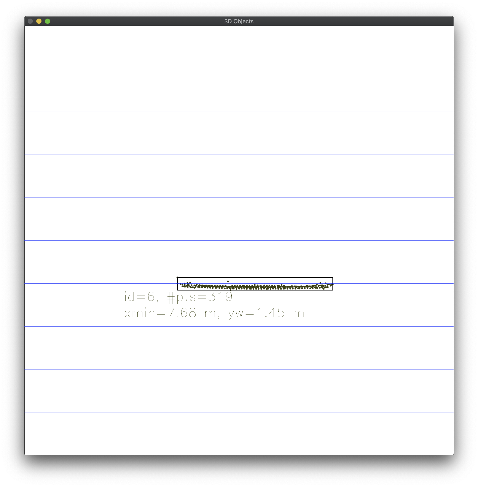
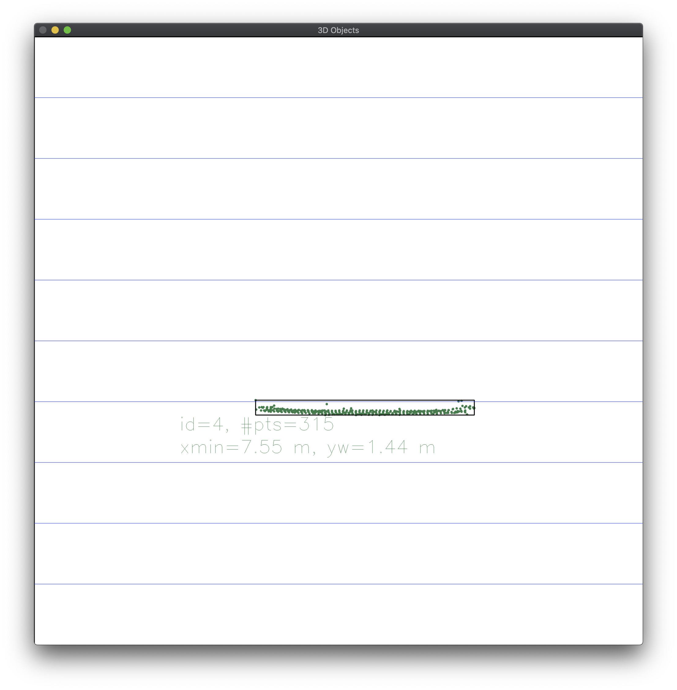
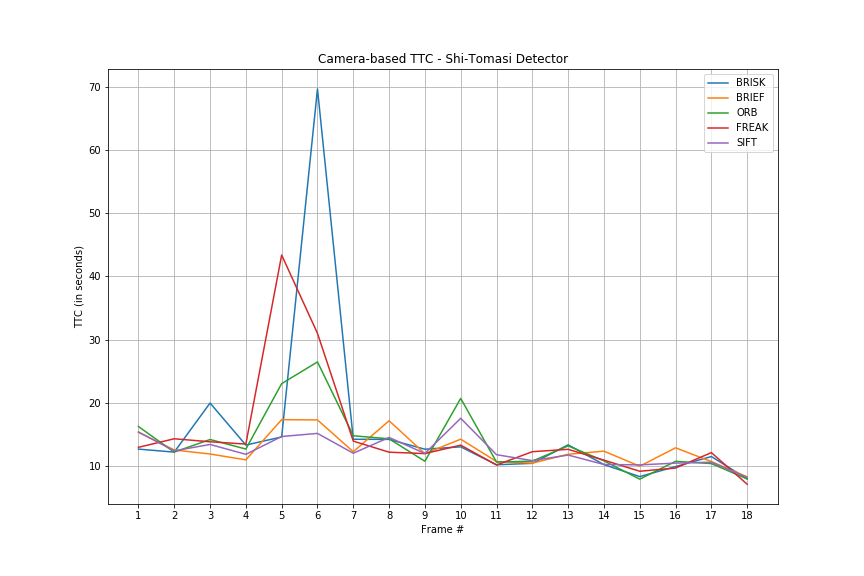
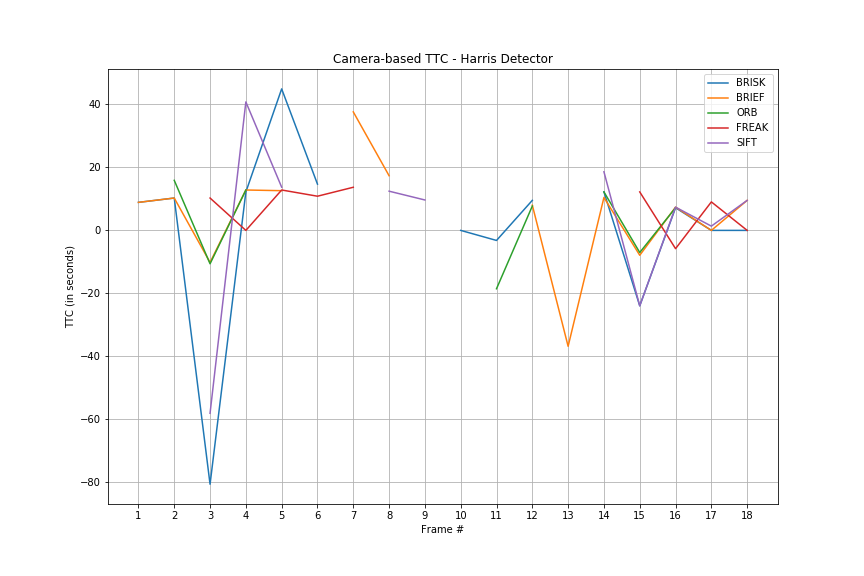
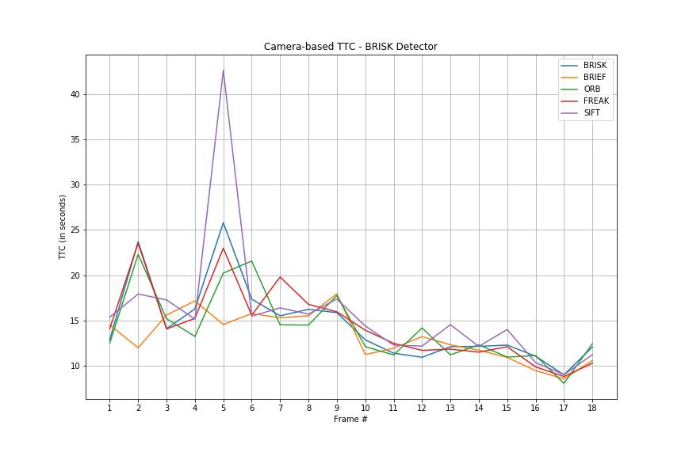
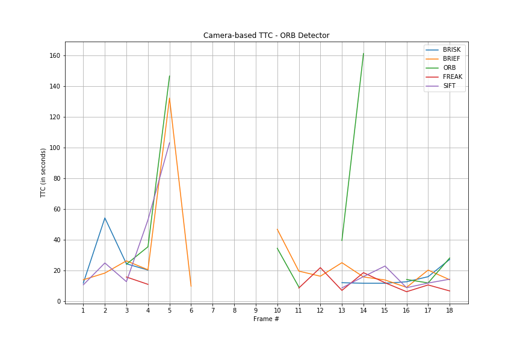
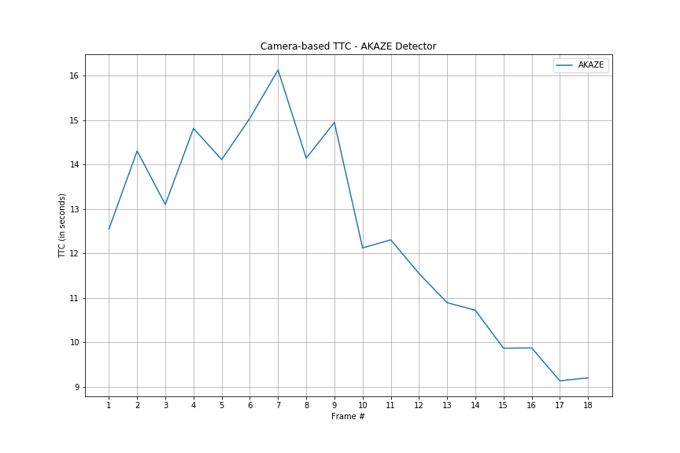
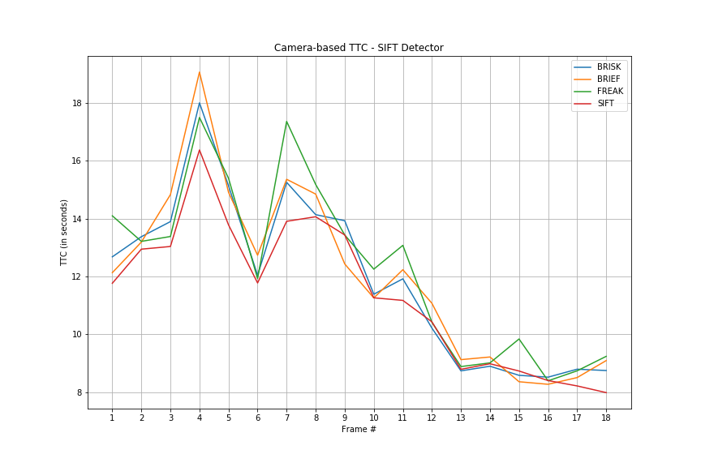
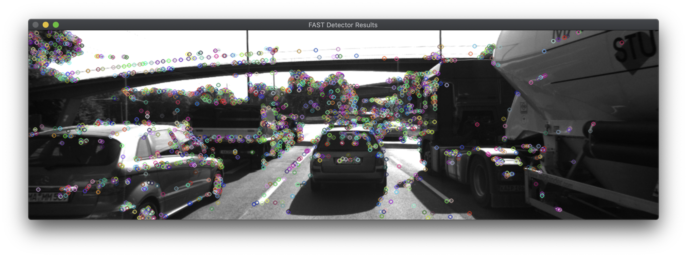

# 3D Object Tracking Project Writeup

This README contains the answers and how I addressed each point in the evaluation rubric as part of the submission for this project for evaluation. Please refer to each section below to review how I have answered each point in the evaluation rubric. This project concerns calculating the Time-to-Collision (TTC) between the ego vehicle, and the vehicle directly in front of it.

Also note that the way to run the main function has changed to accept command-line arguments as this resulted in quicker experimentation preventing constantly editing the source file and rebuilding. To run this executable, please use the following style of invocation:

```
$ ./3D_object_tracking detectorType descriptorType matcherType selectorType bVis bLimitKpts
```

The command-line arguments above match the variable names in the original template of the assignment so that confusion can be avoided.

- `detectorType` : The type of detector to use - one of `SHITOMASI`, `HARRIS`, `FAST`, `BRISK`, `AKAZE`, `SIFT`

- `descriptorType` : The type of descriptor to use - one of `BRISK`, `BRIEF`, `ORB`, `FREAK`, `AKAZE`, `SIFT`

- `matcherType` : Matching algorithm - one of `MAT_BF`, `MAT_FLANN`.

- `selectorType` : Keypoint selection method - one of `SEL_NN`, `SEL_KNN`
- `bVis` : Visualising results - one of `0` (disable), `1` (enable)
- `bLimitKpts` : For limiting keypoint display results - one of `0` (disable), `1` (enable)

The defaults for each variable are:

- `detectorType` : `SHITOMASI`
- `descriptorType` : `BRISK`
- `matcherType` : `MAT_BF`
- `selectorType` : `SEL_NN`
- `bVis` : `1`
- `bLimitKpts` : `0`

You can call the executable by overriding the default variable and specify the relevant options for each above. However, they must be in the order shown above and omitting specifying the variables at the command-line will result in the defaults being used.

For example, by doing:

```
$ ./3D_object_tracking SIFT SIFT MAT_FLANN
```

will make the detector and descriptor type SIFT using FLANN matching, but the selector type will default to `SEL_NN` , and the `bVis` and `bLimitKpts` to be set to true and false respectively or `1` , `0` . Please use the command-line arguments in order to provide the appropriate grading on this project.

--------------------------------------------------------------------------------

## FP.1 - Match 3D Objects

As per the hints from the instructor as well as hints provided on the Udacity forums, the process was indeed quite simple. We first find all unique bounding box IDs that encapsulate objects from the YOLO Object Detector from the previous frame. Next, for each unique bounding box ID from the previous frame, we cycle through all keypoint matches to isolate out those where the source image locations (from the `trainIdx` attribute of `cv::DMatch` ) are within the boundaries of the bounding box described by the bounding box ID itself. Next, for each of these matches, we count how many times we encounter the bounding box ID described by the target image locations (from the `queryIdx` attribute of `cv::DMatch` ). Whichever bounding box ID gives us the largest count, this pair of bounding box IDs between the previous and current frames are thus matched. This has been implemented in `matchBoundingBoxes` and can be found in the `camFusion_Student.cpp` file.

## FP.2 - Compute LiDAR-based TTC

We follow the algorithm as described in the exercises in this course. Following the constant velocity model, we can compute the TTC by examining the point clouds in the ego lane in the previous frame and current frame and find the point that is the closest to the ego vehicle while removing the points in the point cloud that would represent the roof due to the scanning pattern of the LiDAR and its proximity to the origin of the sensor. Thankfully this has been removed from the point cloud. However, the need to remove outliers is important as a noisy reading that is close to the ego vehicle can give an erroneous reading.

Therefore, we take a look at both groups (previous and current frame) of LiDAR points, compute the centroids of the groups in the `x` , `y` and `z` direction separately then we examine the distance from a candidate point in the point cloud from its coordinates to each direction's centroid individually. Should any of the dimensions beyond a threshold, we would deem the point to be an outlier. To determine what is an outlier, we use the method of Interquartile Ranges (IQR): <https://www.purplemath.com/modules/boxwhisk3.htm>.

Specifically, we calculate the distance of each point in the point cloud to the centroid for each dimension separately. This generates three separate lists of distances, one for each dimension. We then calculate the IQR by examining the 25th ( `Q1` ) and 75th percentile ( `Q3` ) of the distances. The IQR is thus defined the difference between 75th and 25th percentile ( `Q3 - Q1` ). Points are considered outliers if a distance is less than `Q1 - 1.5 * IQR` or greater than `Q3 + 1.5 * IQR` . As such, for the point cloud in the previous frame, we find the point that is the closest to the ego vehicle, then see if it is an outlier by checking the IQR thresholds for each dimension. If it is, we remove this point from the point cloud and repeat the above process until we find a point that is an inlier. We repeat the exact same process for the current frame. After the end of this, we will find two points in the previous and current frame that are the closest to the ego vehicle and that are inliers. Using the `x` components for these points, we can finally use them to compute the TTC.  This has been implemented in `computeTTCLidar` and can be found in the `camFusion_Student.cpp` file.

## FP.3 - Associate Keypoint Correspondences with Bounding Boxes

In this step, given the set of keypoints from the previous frame and the current frame, as well as knowing which keypoints from the previous frame match the current frame, we must determine which keypoints are within the bounding box of an object in the current frame. Following a similar procedure to FP.2, we first check to see if the previous and current keypoint are within the bounding box of the current frame. After, we calculate the centroid of the keypoints for the previous frame and current frame separately, then calculate the distance of each keypoint to their respective centroids. This creates two separate lists of distances and thus use the IQR method to determine which distances, and thus which keypoints are outliers. Only the keypoints that are considered inliers are thus associated with the current frame's bounding box. We also remember the matches between the previous and current frame that correspond to these matches within the bounding box as well.

## FP.4 - Compute Camera-Based TTC

The base code for this was taken from the previous exercises in this course. There was a slight but crucial modification in order to make this robust to outliers. Like the original version, we cycle through all possible pairs of keypoint matches. Specifically, we look at every possible 2-tuple groups of keypoint matches where we extract the coordinates for both the previous and current frames, and thus find their distance ratios as we've seen in the lessons. We additionally impose outlier detection by filtering these distance ratios using the IQR method previously discussed, then take the median of the remaining distances to ensure additional robustness. This median distance ratio is thus used to calculate the TTC.  This has been implemented in `computeTTCCamera` and can be found in the `camFusion_Student.cpp` file.

## FP.5 - Performance Evaluation 1 - LiDAR-based TTC

The table below shows the TTC estimate at a particular frame index. Recall that we are using LiDAR points that are bounded within object bounding boxes created by the YOLO Object Detection algorithm, so this is independent of any feature detectors and descriptors used. We will also show the minimum `x` coordinate in the point cloud at each frame to help with the analysis

| Image Index | TTC LiDAR (in seconds) | Min `x` coordinate (in m) |
|:-----------:|:----------------------:|---------------------------|
|      1      |        12.9722         | 7.91                      |
|      2      |         12.264         | 7.85                      |
|      3      |        13.9161         | 7.79                      |
|      4      |        6.51271         | 7.68                      |
|      5      |        7.41552         | 7.64                      |
|      6      |        7.50199         | 7.58                      |
|      7      |        34.3404         | 7.55                      |
|      8      |        9.34376         | 7.47                      |
|      9      |        9.17779         | 7.43                      |
|     10      |        18.0318         | 7.39                      |
|     11      |        3.83244         | 7.20                      |
|     12      |          10.1          | 7.27                      |
|     13      |        9.22307         | 7.19                      |
|     14      |        10.9678         | 7.13                      |
|     15      |        8.09422         | 7.04                      |
|     16      |        3.17535         | 6.83                      |
|     17      |        10.2926         | 6.90                      |
|     18      |        8.30978         | 6.81                      |

The first three frames seem plausible but when we get to frames 4-6, it drops right down to 6.51 seconds. The reason why is because the minimum distance dropped from 7.79 m from frame 3 down to 7.68 m to frame 4\. For the first three frames, the distance to the ego vehicle seems plausible as it looks like we're gradually slowing down. However, at frame 4 there is a sudden jump in closeness meaning that the TTC thus decreases more quickly. The first three frames have a difference of 0.06 m between successive frames, but for frame 4, we have a 0.11 m difference. This is roughly double the distance resulting in the TTC decreasing by half in proportion.

To see what's going on, the two images below show the bird's eye view of the preceding vehicle's point cloud from frames 3 and 4.




We can see that shape of the point cloud of the back of the preceding vehicle is quite similar between the two frames. However, the cluster of points is shifted by the distances mentioned, thus reporting the incorrect TTC. It is not so much the point cloud but the constant velocity model breaks with sudden changes in distance. If we used a constant acceleration model this would report a more accurate TTC. Under the constant velocity model, this certainly goes to show that using LiDAR on its own is not a reliable source of information to calculate the TTC. Another instance is from frames 6 to 7 where the distances shorten from 7.58 m to 7.55 m, but the TTC increases to 34.34 seconds, but clearly we can visually see that the appearance of the preceding vehicle has not changed much between the frames so this is obviously a false reading. The two images below show the bird's eye view of the preceding vehicle's point cloud from frames 6 and 7.




As we can clearly see, the point clouds are well formed but due to the constant velocity model, a short displacement between frames breaks down this assumption quickly.

## FP.6 - Performance Evaluation 2

We will show 7 graphs demonstrating the TTC using the camera-based approach for each possible combination of detector and descriptor. Each graph will show results for each possible detector where each trace on the graph will plot the TTC trend of each frame for a descriptor. As noted in the midterm report, it is not possible to use AKAZE descriptors with anything else other than AKAZE keypoints. Also, using the SIFT detector and the ORB descriptor causes out-of-memory issues, so we skip using that as well. To simulate the industry, standard, we use FLANN matching with kNN selection for efficiency.














With the above results, we can see several problems depending on what combination of detector and descriptor one uses. The estimate can be really high, or there were no keypoints detected in the vicinity of the preceding vehicle which leads to a `NAN` being reported or no TTC being calculated at all.

Let's take for example the FAST detector with the SIFT descriptor where the TTC is roughly 250 seconds at frame index 5 (!!!). The images below show the matched keypoints within the preceding vehicle's bounding box between frames 4 and 5 as well as the keypoint detections for frame 5.




If you look at the matched results closely, we are actually matching keypoints that are not on the preceding vehicle but on the car far in the distance in the lane of the truck (on the right). With the outlier filtering, because the further car is visible between the frames and the matched distances appear to be small, this would not immediately be perceived as an outlier but because we are not limiting ourselves to the preceding vehicle as it is simply a bounding box containment check, we will obviously get erroneous results.

Let us look at another example where we could not reliably calculate the TTC. For example, let's look at the ORB detector and ORB descriptor at frame 8.


The matching results between frames 7 and 8 are very sparse. In particular, the keypoints within the preceding vehicle's object bounding box are detected right on the edges surrounding the car. With these points, the distance ratios between pairs of keypoints will be close to 1 because the displacement of the keypoints along the edges of the vehicle will appear to be small between frame 7 and 8\. With such a small displacement, most of the pairs of ratios will be 1, thus when we calculate the TTC, we will get infinity as the answer.

As such, we need to be sure that we use a keypoint detector that can reliably find keypoints all around the back of the preceding vehicle. By examining all of the graphs, using the BRISK detector and BRIEF descriptor not only gives the trend of TTC times that we want, we are able to calculate the TTC successfully over all frames without any obvious outliers. Therefore, I recommend that we use BRISK + BRIEF as the final combination for estimating the TTC using images and feature-based methods only.
